# WordPress Opening Hours

Opening Hours is a highly customizable WordPress plugin to set up your venue's opening hours and display them with Shortcodes and Widgets.

## Contents
* [Features](#features)
* [Installation](#installation)
	* [WordPress Plugin Installer](#wordpress-plugin-installer)
	* [Manual Installation](#manual-installation)
	* [Composer](#composer)
	* [Clone GitHub Repository](#clone-repository)
* [Getting Started](#getting-started)
	* [Setting up your Opening Hours](#set-up)
	* [Child Sets](#child-sets)
* [Widgets](#widgets)
	* [Overview Widget](#overview-widget)
	* [Is Open Widget](#is-open-widget)
	* [Holidays Widget](#holidays-widget)
	* [Irregular Openings Widget](#irregular-openings-widget)
* [Shortcodes](#shortcodes)
	* [Common Attributes](#common-attributes)
	* [[op-overview] Shortcode](#op-overview-shortcode)
	* [[op-is-open] Shortcode](#op-is-open-shortcode)
	* [[op-holidays] Shortcode](#op-holidays-shortcode)
	* [[op-irregular-openings] Shortcode](#op-irregular-openings-shortcode)
* [Troubleshooting / FAQ](#troubleshooting)
* [Contributing](#contributing)
	* [Contributing to Code](#contributing-to-code)
	* [Contributing to Translations](#contributing-to-translations)
* [Changelog](#changelog)
* [Donate](#donate)
* [License](#license)

## Further Reading
* [Developer Guide](./doc/developer-guide.md)
* [Filters](./doc/filters.md)
* [Set Providers](./doc/set-providers.md)

## Features
* Supports multiple Sets of Opening Hours (e.g. one for your restaurant and one for your bar) that you can use independently.
* Supports Hollidays
* Supports Irregular Openings (e.g. different opening hours during Christmas)
* Supports child sets that overwrite your regular opening hours in a specific time period (e.g. seasonal opening hours or an extra day in every second week)
* Four highly customizable Widgets and Shortcodes also displaying contextual information (e.g. "We're currently closed but will be open again on Monday at 8am")

[↑ Table of Contents](#contents)

## Installation

**Please Note: The Opening Hours Plugin is currently in beta. If you want to use the beta version, you will have to [clone the repository](#clone-repository) or download the .zip file and install it manually**

### WordPress Plugin Installer
1. Go to your WordPress dashboard
1. Navigate to "Plugins"
1. Click "Install"
1. Search for "Opening Hours"
1. Click "Install" on the Plugin "Opening Hours" by Jannik Portz
1. Activate the Plugin

### Manual Installation
1. Download the .zip-archive from <https://wordpress.org/plugins/wp-opening-hours/>
1. Unzip the archive
1. Upload the directory /opening-hours to your wp-content/plugins
1. In your Admin Panel go to Plugins and active the Opening Hours Plugin
1. Now you can edit your Opening Hours in the Settings-Section
1. Place the Widgets in your Sidebars or use the Shortcode in your posts and Pages

### Composer
If you are managing your WordPress Plugins via composer (e.g. when using [Bedrock](https://roots.io/bedrock/docs/composer/)) the Opening Hours Plugin is also available on [wpackagist](https://wpackagist.org/).

Make sure you have wpackagist registered as repository in your composer.json file

~~~json
"repositories": [
  {
    "type": "composer",
    "url": "https://wpackagist.org"
  }
],
~~~

Add the Opening Hours plugin as dependency

~~~json
"require": {
  "wpackagist-plugin/wp-opening-hours": "1.2"
}
~~~

### From GitHub repository
Especially when installing a beta version for testing it makes sense to clone the GitHub Repository and checkout the branch
from which you want to install the plugin. Before you can actually use the plugin you will have to perform the following steps **(Node.js required)**

1. Open your command line and navigate to the project directory
1. Make sure you have already loaded the submodules. If not run `git submodule update`
1. If you do not already have gulp installed globally run `npm install -g gulp`
1. `npm install`
1. `gulp build`

Alternatively you can also clone the repository somewhere on your computer and run `gulp export` instead of `gulp build`.
A .zip archive containing a built version of the plugin will be placed inside the project directory that you can unzip and place in
the `wp-content/plugins` directory of the WordPress installation of your choice.

[↑ Table of Contents](#contents)

## Getting Started
### Setting up your Opening Hours

The first step to set up your Opening Hours is to create a Set.
A Set consists of Periods for all weekdays, Holidays and Irregular Openings.
If you only want to display the Opening Hours for one venue you're fine with a single Set but you can as well add multiple Sets, each representing individual Opening Hours. You can for example add one Set for your restaurant and one Set for your Bar if you use one website for them and specify the desired Set per Widget or Shortcode.

**Please Note: You will need to have administrator priviledges to manage Sets**

**Step 1:** Go to your admin Dashboard and navigate to "Opening Hours". You will see a list of all your Sets. To add a new Set click "Add New" next to the heading.

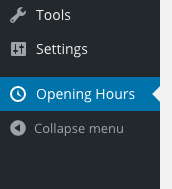

**Step 2:** Give your Set a name in the "Enter title here" input. The name is only used internally and you can specify individual titles per Widget or Shortcode.

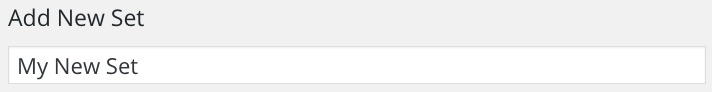

**Step 3:** Set up Opening Hours. In the Opening Hours Section you can edit the time inputs for each weekday. When clicking the `+`-Button you can add more periods per day. When clicking the `x`-Button next to a period you can delete periods.

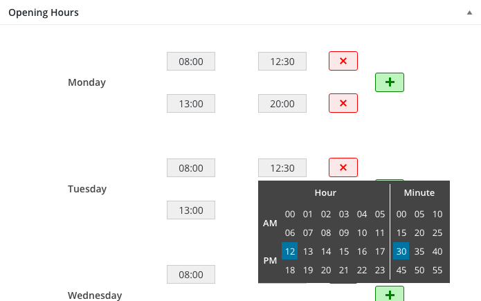

**Step 4:** Set up Holidays. In the Holidays Section you can edit the name and the start and end dates. When clicking the "Add New Holiday" you can add more Holidays. You can also delete holidays when clicking the `x`-Button next to a Holiday.

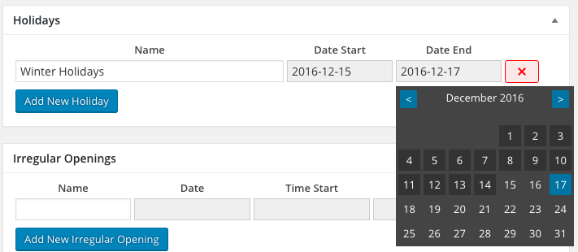

**Step 5:** Set up Irregular Openings. Irregular Openings specify irregular opening hours for a specific day. You would for example add an Irregular Opening for NYE when you are only open in the morning. You can edit the name, the date and start and end time.  
When clicking the "Add New Irregular Opening" you can add more Irregular Openings. You can also delete Irregular Openings when clicking the `x`-Button next to a row.

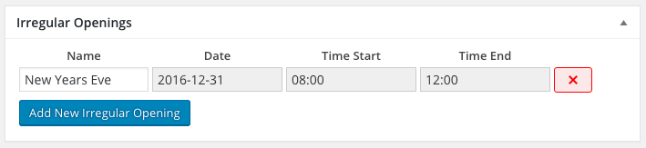

**Step 6 (optional):** In the Set Details Section you can give your Set a description. This is optional but the description can be displayed in the Overview Widget/Shortcode.

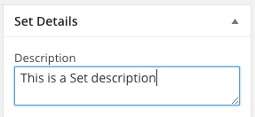

**Step 7 (optional):** In the Set Details section you can also set your custom Set Alias [which you can use instead of the Set Id in Shortcodes.](#common-attributes) If you specify a specific Set Alias for more than one Set all Shortcodes will use the Set with the least value for `menu_order`.  
Your Theme or a 3rd party Plugin [may also specify Set Alias presets](./doc/filters.md#op_set_alias_presets) to make it easier for yor to enter the right one. Please note that Set Alias presets only work in browsers supporting HTML5 `datalist`.

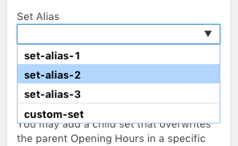

**Step 8:** Save the data by clicking the "Save"/"Publish"-Button. **Any changes will not be saved without saving the whole Set!**

### Child Sets

You may also set up child Sets with different Opening Hours for a longer Period of time. You can define a date range or a week scheme (even/odd weeks) when the Opening Hours of the Child Set should be used. You can for example use Child Sets if you have different Opening Hours in winter.   
In Child Sets you can only set up Opening Hours but no Holidays or Irregular Openings.

**Step 1:** Make sure you have another Set which you can use as parent Set with the "regular" Opening Hours.

**Step 2:** Add a new Set by clicking the "Add New"-Button in the list of Sets.

**Step 3:** In the Attributes Section select the parent Set under "Parent".

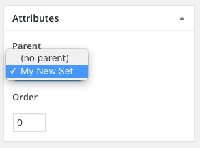

**Step 4:** Click the "Save"/"Publish"-Button

**Step 5:** Set up the custom Opening Hours for the Child Set.

**Step 6:** Set the usage criteria in the Set Details Section. You can set a start and end date and/or a week scheme. Note that if you don't set start or end date and leave week scheme at "Every Week" the Child Set will never be used.

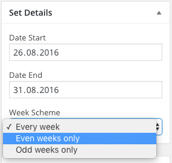

**Step 7:** Save the Child Set.

The Plugin will now automatically use the Opening Hours of the Child Set when the usage criteria matches the current time.

[↑ Table of Contents](#contents)

## Widgets
### Overview Widget
The Overview widget displays a table with all the opening hours in the speficied set.  
There are the following options:

<table>
	<thead>
		<th width="25%">Name</th>
		<th>Description</th>
	</thead>
	<tbody>
		<tr>
			<td>Title</td>
			<td>The title of the Widget. Will be displayed above the opening hours</td>
		</tr>
		<tr>
			<td>Set to show</td>
			<td>Select the set whose opening hours you want to show</td>
		</tr>
		<tr>
			<td>Highlight</td>
			<td>
			Select which type of information shall be highlighted. 
			Possible options are:
			<ul>
				<li>Nothing</li>
				<li>Running Period</li>
				<li>Current Weekday</li>
			</ul>
			</td>
		</tr>
		<tr>
			<td>Show closed days</td>
			<td>Whether to display a row for closed days with a "Closed"-caption</td>
		</tr>
		<tr>
			<td>Show description</td>
			<td>Whether to display the set description above the opening hours</td>
		</tr>
		<tr>
			<td>Compress opening hours</td>
			<td>Whether to compress the opening hours. This means that the plugin will search for days with mutual opening hours and then group those together to one row in the table with a title like "Monday - Wednesday".</td>
		</tr>
		<tr>
			<td>Use short day captions</td>
			<td>Whether to use abbreviations for weekdays. E.g. "Monday" becomes "Mon.". This feature is also available in all other supported languages.</td>
		</tr>
		<tr>
			<td>Include Irregular Openings</td>
			<td>If there is an irregular opening on any day in the table it will replace the regular opening hours with the irregular opening hours for that day.</td>
		</tr>
		<tr>
			<td>Include Holidays</td>
			<td>If there is a holiday during one or more days in the table it will replace the regular opening hours of those days with the name of the holiday.</td>
		</tr>
		<tr>
			<td>Template</td>
			<td>You can choose among two templates: Table and List. The list template will display all data in a vertical list. This is useful for narrow sidebars.</td>
		</tr>
	</tbody>
	<thead>
		<th colspan="2">Extended Settings</th>
	</thead>
	<tbody>
		<tr>
			<td>Caption closed</td>
			<td>Speficy a custom caption for closed days.</td>
		</tr>
		<tr>
			<td>Highlighted period class</td>
			<td>Custom CSS class for highlighted periods. default <code>highlighted</code></td>
		</tr>
		<tr>
			<td>Highlighted day class</td>
			<td>Custom CSS class for highlighted days. default: <code>highlighted</code></td>
		</tr>
		<tr>
			<td>PHP Time Format</td>
			<td>Custom format for times. The default is your standard WordPress setting. <a href="http://bit.ly/16Wsegh" target="_blank">More on PHP date and time formats</a></td>
		</tr>
		<tr>
			<td>Hide date of irregular openings</td>
			<td>Whether to hide the date of irregular openings if they are in the table.</td>
		</tr>
	</tbody>
</table>

#### Overview Widget in table view
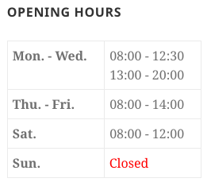

#### Overview Widget in list view
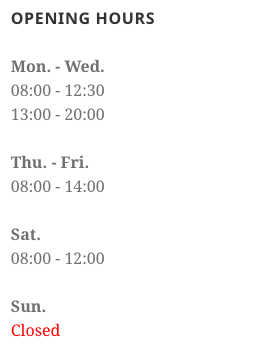

#### Overview Widget Options

### Is Open Widget
The Is Open Widget displays a message whether a venue (a Set) is currently open/active.  
There are the folliwing options:

<table>
	<thead>
		<th width="25%">Name</th>
		<th>Description</th>
	</thead>
	<tbody>
		<tr>
			<td>Title</td>
			<td>The Widget Title</td>
		</tr>
		<tr>
			<td>Set</td>
			<td>Select a set whose opening status you want to show</td>
		</tr>
		<tr>
			<td>Show next open period</td>
			<td>When select, a message telling the next open period will be displayed if the venue (set) is currently closed.</td>
		</tr>
	</tbody>
	<thead>
		<th colspan="2">Extended Settings</th>
	</thead>
	<tbody>
		<tr>
			<td>Caption if open</td>
			<td>Custom caption to show when the venue is open</td>
		</tr>
		<tr>
			<td>Cpation if closed</td>
			<td>Custom caption to show when the venue is closed</td>
		</tr>
		<tr>
			<td>Class if open</td>
			<td>Custom CSS class when the venue is open</td>
		</tr>
		<tr>
			<td>Class if closed</td>
			<td>Custom CSS class when the venue is closed</td>
		</tr>
		<tr>
			<td>Next Period string format</td>
			<td>A custom string format for the next open period message. 
			You can populate the string with the following placeholders:
			<ul>
				<li><code>%1$s</code> The formatted date of the next open period</li>
				<li><code>%2$s</code> The name of the weekday of the next open period</li>
				<li><code>%3$s</code> The formatted start time of the next open period</li>
				<li><code>%4$s</code> The formatted end time of the next open period</li>
			</ul>
			Example: <code>We're open again on %2$s (%1$s) from %3$s to %4$s</code>
			</td>
		</tr>
		<tr>
			<td>PHP Date Format</td>
			<td>Custom PHP date format for the date of the next open period. The default is your standard WordPress setting. <a href="http://bit.ly/16Wsegh" target="_blank">More on PHP date and time formats</a></td>
		</tr>
		<tr>
			<td>PHP Time Format</td>
			<td>Custom PHP date format for the start and end time of the next open period. The default is your standard WordPress setting. <a href="http://bit.ly/16Wsegh" target="_blank">More on PHP date and time formats</a></td>
		</tr>
	</tbody>
</table>

#### Is Open Widget showing next open Period
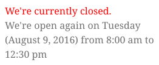

#### Is Open Widget Options
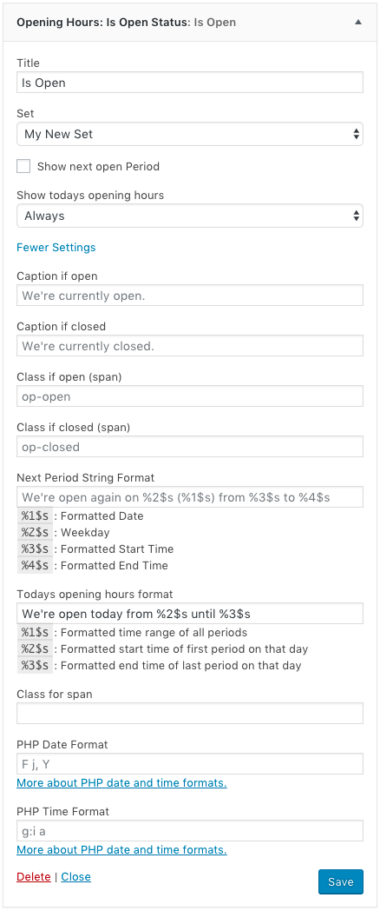

### Holidays Widget
The holiday widget displays all holidays in the specified set in a table or list.  
There are the following options:

<table>
	<thead>
		<th width="25%">Name</th>
		<th>Description</th>
	</thead>
	<tbody>
		<tr>
			<td>Title</td>
			<td>The Widget title</td>
		</tr>
		<tr>
			<td>Set</td>
			<td>Select a set whose holidays you want to display.</td>
		</tr>
		<tr>
			<td>Highlight active holidays</td>
			<td>Whether to highlight active holidays in the table</td>
		</tr>
		<tr>
			<td>Template</td>
			<td>You can choose among two templates: Table and List. The list template will display all data in a vertical list. This is useful for narrow sidebars.</td>
		</tr>
	</tbody>
	<thead>
		<th colspan="2">Extended Settings</th>
	</thead>
	<tbody>
		<tr>
			<td>Class for highlighted Holiday</td>
			<td>Custom CSS class for highlighted Holidays. default: <code>highlighted</code></td>
		</tr>
		<tr>
			<td>PHP Date Format</td>
			<td>Custom PHP date format for the start and end date of the holidays. The default is your standard WordPress setting. <a href="http://bit.ly/16Wsegh" target="_blank">More on PHP date and time formats</a></td>
		</tr>
	</tbody>
</table>

#### Holidays Widget in table view
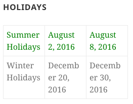

#### Holidays Widget in list view
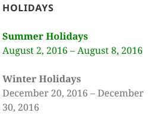

#### Holidays Widget Options
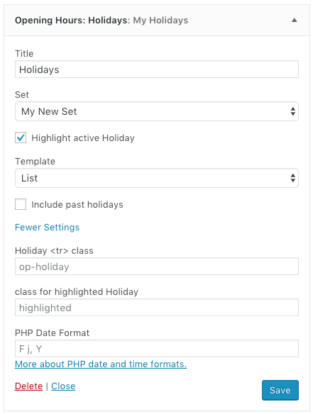

### Irregular Openings Widget

The Irregular Openings Widget displays all Irregular Openings in the specified Set in a table or list.  
There are the following options:

<table>
	<thead>
		<th width="25%">Name</th>
		<th>Description</th>
	</thead>
	<tbody>
		<tr>
			<td>Title</td>
			<td>The Widget title</td>
		</tr>
		<tr>
			<td>Set</td>
			<td>Select a Set whose Irregular Openings you want to show.</td>
		</tr>
		<tr>
			<td>Highlight active Irregular Opening</td>
			<td>Whether to highlight active irregular openings in the table or list</td>
		</tr>
		<tr>
			<td>Template</td>
			<td>You can choose among two templates: Table and List. The list template will display all data in a vertical list. This is useful for narrow sidebars.</td>
		</tr>
	</tbody>
	<thead>
		<th colspan="2">Extended Settings</th>
	</thead>
	<tbody>
		<tr>
			<td>Class for Highlighted Irregular Opening</td>
			<td>Custom CSS class for highlighted Irregular Openings in the table or list. default: <code>highlighted</code></td>
		</tr>
		<tr>
			<td>PHP Date Format</td>
			<td>Custom PHP date format for the date of the irregular openings. The default is your standard WordPress setting. <a href="http://bit.ly/16Wsegh" target="_blank">More on PHP date and time formats</a></td>
		</tr>
		<tr>
			<td>PHP Time Format</td>
			<td>Custom PHP date format for the start and end time of the irregular openings. The default is your standard WordPress setting. <a href="http://bit.ly/16Wsegh" target="_blank">More on PHP date and time formats</a></td>
		</tr>
	</tbody>
</table>

#### Irregular Openings Widget in list view
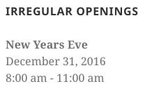

#### Irregular Openings Widget options
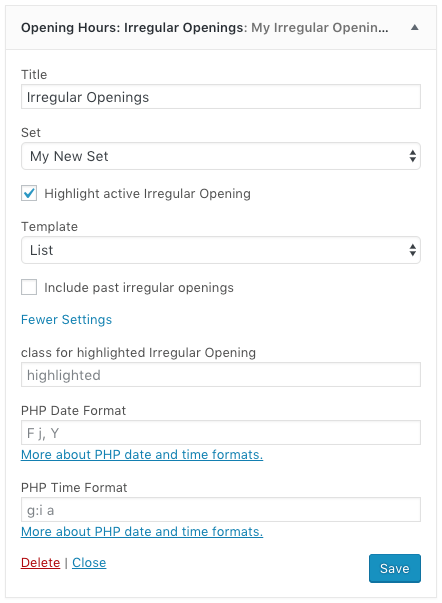

[↑ Table of Contents](#contents)

## Shortcodes
Shortcodes have exactly the same options as Widgets because every Widget is basically a representation of the corresponding Shortcode with a GUI for the Widget edit section.  
**The only required attribute for all Shortcodes is `set_id`. All other attributes are optional!**

### Common attributes for all Shortcodes
<table>
	<thead>
		<th width="25%">Name</th>
		<th width="15%">Type</th>
		<th width="15%">Default</th>
		<th width="45%">Description</th>
	</thead>
	<tbody>
		<tr>
			<td><code>set_id</code></td>
			<td><code>int|string</code></td>
			<td>–</td>
			<td><strong>(required)</strong> The id of the set whose data you want to show. For regular Sets you may also use <a href="#getting-started-specify-set-alias">your custom Set Alias here</a></td>
		</tr>
		<tr>
			<td><code>title</code></td>
			<td><code>string</code></td>
			<td>–</td>
			<td>The widget title</td>
		</tr>
		<tr>
			<td><code>before_title</code></td>
			<td><code>string</code></td>
			<td><code>&lt;h3 class="op-{name}-title"&gt;</code></td>
			<td>HTML before the title. When using Widgets this will be overridden by the sidebar's <code>before_title</code> attribute.</td>
		</tr>
		<tr>
			<td><code>after_title</code></td>
			<td><code>string</code></td>
			<td><code>&lt;/h3&gt;</code></td>
			<td>HTML after the title. When using Widgets this will be overridden by the sidebar's <code>after_title</code> attribute.</td>
		</tr>
		<tr>
			<td><code>before_widget</code></td>
			<td><code>string</code></td>
			<td><code>&lt;div class="op-{name}-shortcode"&gt;</code></td>
			<td>HTML before shortcode contents. When using Widgets this will be overridden by the sidebar's <code>before_widget</code> attribute.</td>
		</tr>
		<tr>
			<td><code>after_widget</code></td>
			<td><code>string</code></td>
			<td><code>&lt;/div&gt;</code></td>
			<td>HTML after shortcode contents. When using Widgets this will be overridden by the sidebar's <code>after_widget</code> attribute.</td>
		</tr>
	</tbody>
</table>

### op-overview Shortcode
Corresponds to the Overview Widget.  
The **[op-overview]** shortcode displays the opening hours of the specified set.  
The following attributes are available (Also mind the **[Common Attributes](#common-attributes)**):

<table>
	<thead>
		<th width="25%">Name</th>
		<th width="15%">Type</th>
		<th width="15%">Default</th>
		<th width="45%">Description</th>
	</thead>
	<tbody>
		<tr>
			<td><code>show_closed_days</code></td>
			<td><code>bool</code></td>
			<td><code>false</code></td>
			<td>Whether to display a row for closed days with a "Closed"-caption</td>
		</tr>
		<tr>
			<td><code>show_description</code></td>
			<td><code>bool</code></td>
			<td><code>false</code></td>
			<td>Whether to display the set description above the opening hours</td>
		</tr>
		<tr>
			<td><code>highlight</code></td>
			<td><code>string</code></td>
			<td><code>noting</code></td>
			<td>What type of information to highlight. Possible values are: <code>noting</code>, <code>period</code> (currently active period), <code>day</code> (current weekday)</td>
		</tr>
		<tr>
			<td><code>compress</code></td>
			<td><code>bool</code></td>
			<td><code>false</code></td>
			<td>Whether to compress the opening hours. This means that the plugin will search for days with mutual opening hours and then group those together to one row in the table with a title like "Monday - Wednesday".</td>
		</tr>
		<tr>
			<td><code>short</code></td>
			<td><code>bool</code></td>
			<td><code>false</code></td>
			<td>Whether to use abbreviations for weekdays. E.g. "Monday" becomes "Mon.". This feature is also available in all other supported languages.</td>
		</tr>
		<tr>
			<td><code>include_io</code></td>
			<td><code>bool</code></td>
			<td><code>false</code></td>
			<td>If there is an irregular opening on any day in the table it will replace the regular opening hours with the irregular opening hours for that day.</td>
		</tr>
		<tr>
			<td><code>include_holidays</code></td>
			<td><code>bool</code></td>
			<td><code>false</code></td>
			<td>If there is a holiday during one or more days in the table it will replace the regular opening hours of those days with the name of the holiday.</td>
		</tr>
		<tr>
			<td><code>highlighted_period_class</code></td>
			<td><code>string</code></td>
			<td><code>highlighted</code></td>
			<td>CSS class for highlighted periods</td>
		</tr>
		<tr>
			<td><code>highlighted_day_class</code></td>
			<td><code>string</code></td>
			<td><code>highlighted</code></td>
			<td>CSS class for current weekday</td>
		</tr>
		<tr>
			<td><code>time_format</code></td>
			<td><code>string</code></td>
			<td>WordPress setting</td>
			<td>Custom format for times. The default is your standard WordPress setting. <a href="http://bit.ly/16Wsegh" target="_blank">More on PHP date and time formats</a></td>
		</tr>
		<tr>
			<td><code>hide_io_date</code></td>
			<td><code>bool</code></td>
			<td><code>false</code></td>
			<td>Whether to hide the date of irregular openings if they are in the table.</td>
		</tr>
		<tr>
			<td><code>template</code></td>
			<td><code>string</code></td>
			<td><code>table</code></td>
			<td>Identifier for the template to use. Possible values are <code>table</code> and <code>list</code></td>
		</tr>
	</tbody>
</table>

### op-is-open Shortcode
Corresponds to the Is Open Widget.  
The **[op-is-open]** shortcode displays a message whether the specified venue (set) is currently open or not.  
The following attributes are available (Also mind the **[Common Attributes](#common-attributes)**):

<table>
	<thead>
		<th width="25%">Name</th>
		<th width="15%">Type</th>
		<th width="15%">Default</th>
		<th width="45%">Description</th>
	</thead>
	<tbody>
		<tr>
			<td><code>open_text</code></td>
			<td><code>string</code></td>
			<td>We're currently open (translated)</td>
			<td>Caption to show when the venue is open</td>
		</tr>
		<tr>
			<td><code>closed_text</code></td>
			<td><code>string</code></td>
			<td>We're currently closed (translated)</td>
			<td>Caption to show when the venue is closed</td>
		</tr>
		<tr>
			<td><code>show_next</code></td>
			<td><code>bool</code></td>
			<td><code>false</code></td>
			<td>When <code>true</code>, a message telling the next open period will be displayed if the venue (set) is currently closed.</td>
		</tr>
		<tr>
			<td><code>next_format</code></td>
			<td><code>string</code></td>
			<td>We're open again on <code>%2$s</code> (<code>%1$s</code>) from <code>%3$s</code> to <code>%4$s</code></td>
			<td>A custom string format for the next open period message. 
			You can populate the string with the following placeholders:
			<ul>
				<li><code>%1$s</code> The formatted date of the next open period</li>
				<li><code>%2$s</code> The name of the weekday of the next open period (translated)</li>
				<li><code>%3$s</code> The formatted start time of the next open period</li>
				<li><code>%4$s</code> The formatted end time of the next open period</li>
			</ul></td>
		</tr>
		<tr>
			<td><code>open_class</code></td>
			<td><code>string</code></td>
			<td><code>op-open</code></td>
			<td>CSS class if the venue (set) is open</td>
		</tr>
		<tr>
			<td><code>closed_class</code></td>
			<td><code>string</code></td>
			<td><code>op-closed</code></td>
			<td>CSS class if the venue (set) is closed</td>
		</tr>
		<tr>
			<td><code>date_format</code></td>
			<td><code>string</code></td>
			<td>WordPress setting</td>
			<td>PHP date format for the date of the next open period. <a href="http://bit.ly/16Wsegh" target="_blank">More on PHP date and time formats</a></td>
		</tr>
		<tr>
			<td><code>time_format</code></td>
			<td><code>string</code></td>
			<td>WordPress setting</td>
			<td>PHP date format for the start and end time of the next open period. <a href="http://bit.ly/16Wsegh" target="_blank">More on PHP date and time formats</a></td>
		</tr>
	</tbody>
</table>

### op-holidays Shortcode
Corresponds to the Holidays Widget.  
The **[op-holidays]** shortcode displays all holidays in the specified set in a table or list.  
The following attributes are available (Also mind the **[Common Attributes](#common-attributes)**):

<table>
	<thead>
		<th width="25%">Name</th>
		<th width="15%">Type</th>
		<th width="15%">Default</th>
		<th width="45%">Description</th>
	</thead>
	<tbody>
		<tr>
			<td><code>highlight</code></td>
			<td><code>bool</code></td>
			<td><code>false</code></td>
			<td>Whether to highlight currently active holidays</td>
		</tr>
		<tr>
			<td><code>class_holiday</code></td>
			<td><code>string</code></td>
			<td><code>op-holiday</code></td>
			<td>CSS class for a single holiday</td>
		</tr>
		<tr>
			<td><code>class_highlighted</code></td>
			<td><code>string</code></td>
			<td><code>highlighted</code></td>
			<td>CSS class for highlighted holidays</td>
		</tr>
		<tr>
			<td><code>date_format</code></td>
			<td><code>string</code></td>
			<td>WordPress setting</td>
			<td>PHP date format for the start and end date of the holidays. <a href="http://bit.ly/16Wsegh" target="_blank">More on PHP date and time formats</a></td>
		</tr>
		<tr>
			<td><code>template</code></td>
			<td><code>string</code></td>
			<td><code>table</code></td>
			<td>Identifier for the template to use. Possible values are <code>table</code> and <code>list</code></td>
		</tr>
	</tbody>
</table>

### op-irregular-openings Shortcode
Corresponds to the Irregular Openings Widget.  
The **[op-irregular-openings]** shortcode displays all irregular openings in the specified set in a table or list.  
The following attributes are available (Also mind the **[Common Attributes](#common-attributes)**):

<table>
	<thead>
		<th width="25%">Name</th>
		<th width="15%">Type</th>
		<th width="15%">Default</th>
		<th width="45%">Description</th>
	</thead>
	<tbody>
		<tr>
			<td><code>highlight</code></td>
			<td><code>bool</code></td>
			<td><code>false</code></td>
			<td>Whether to highlight currently active irregular openings.</td>
		</tr>
		<tr>
			<td><code>class_highlighted</code></td>
			<td><code>string</code></td>
			<td><code>highlighted</code></td>
			<td>CSS class for highlighted irregular openings</td>
		</tr>
		<tr>
			<td><code>date_format</code></td>
			<td><code>string</code></td>
			<td>WordPress setting</td>
			<td>PHP date format for the date of the irregular openings. <a href="http://bit.ly/16Wsegh" target="_blank">More on PHP date and time formats</a></td>
		</tr>
		<tr>
			<td><code>time_format</code></td>
			<td><code>string</code></td>
			<td>WordPress setting</td>
			<td>PHP date format for the start and end time of the irregular openings. <a href="http://bit.ly/16Wsegh" target="_blank">More on PHP date and time formats</a></td>
		</tr>
		<tr>
			<td><code>template</code></td>
			<td><code>string</code></td>
			<td><code>table</code></td>
			<td>Identifier for the template to use. Possible values are <code>table</code> and <code>list</code></td>
		</tr>
	</tbody>
</table>

[↑ Table of Contents](#contents)

## Troubleshooting / FAQ
### Where can I set the standard date and time formats?
If you worked with previous verions of the Plugin you may miss the settings page. The new version of the Plugin uses your WordPress setting you can set under **Settings > General**  
Furthermore you may also set your custom date and time formates per Widget / Shortcode.

### The Is Open Widget / Shortcode does not work properly
The calculation of the Is Open status depends on the Timezone setting in WordPress. Please double check your Timezone setting under **Settings > General** before opening an issue.

[↑ Table of Contents](#contents)

## Contributing
### Contribute to Code

The development of the Opening Hours Plugin takes place at [GitHub](https://github.com/janizde/WP-Opening-Hours).  
If you want to contribute feel free to fork the repository and send pull requests.

##### GitFlow 
The project uses GitFlow. You can get more information on GitFlow on the [GitFlow Cheat Sheet](http://danielkummer.github.io/git-flow-cheatsheet/).  
When forking the repository for contributions please fork from the `develop` branch. If the pull request will be accepted it will be released to the `master` branch for a new version of the Plugin.

##### Unit Testing
The core logic of the Plugin (classes that are not in the `OpeningHours\Module` namespace) is covered with [PHPUnit](https://phpunit.de/) tests (version 4.8).  
If you find an issue in the core logic please write one or more unit test which demonstrate this issue. If you add something to the core logic please also write a unit test. Also, before sending a pull request, run all unit tests to check whether your change has broken anything (it will be automatically tested by travis anyway).

### Contribute to Translations

(Plugin) translation files (`.po` and `.mo`) files contain translations for all strings that are included in the plugin source code, e.g. labels for the widget edit inputs. In this plugin this are mostly strings that occur in the WordPress admin.  
This means you can customize every string presented on your WordPress Front-End site using Widget and/or Shortcode options. If the Plugin has not yet been translated to your language and you are fine with English in your WordPress admin you do not have to submit your own translations but can cutomize the Widget/Shortcode strings to match the language of your site.
However, you can still submit your translations to [Polyglots](#polyglots) so other Plugin users can benefit from it.

The translations of weekdays are not included in the Plugin translations but are loaded from the WordPress core translations. This serves the purpose, that these are always translated to the language that your WordPress installation runs on independently of the Plugin translation progress.

#### [WordPress Polyglots](https://translate.wordpress.org/projects/wp-plugins/wp-opening-hours)
Polyglots is the name of the community of volunteers translating WordPress resources like Themes, Plugins and also the WordPress core. It has become a central place for WordPress translation and is tightly coupled with the WordPress Theme/Plugin repositories.

Since version 2.0 the translation of the Opening Hours Plugin takes place at [translate.wordpress.org](https://translate.wordpress.org/projects/wp-plugins/wp-opening-hours). Advantages of using Polyglots:

* Larger translation community
* Translation can be separated from the actual development of the Plugin
* Supports automatic translation updates, so you do not have to wait for the next release to get new translations

If you want to contribute to translations and there is no Project Translation Editor for your locale, please drop me a message or open an issue with your WordPress.org username and I will request an editorship for your locale.  
You can find out more about project translation roles [here.](https://make.wordpress.org/polyglots/handbook/about/teams/)  

If you have already translated the Plugin on translate.jannikportz.de, I have transferred all translations to the [translate.wordpress.org project](https://translate.wordpress.org/projects/wp-plugins/wp-opening-hours).
You will then also need to become a Project Translation Editor to approve your translations (I know this is a bit tedious).
So in this case please also drop me a message or open an issue with your WordPress.org account name.

If you can not translate the whole plugin or don't want to wait until everything is approved you may perform the following steps to immediately use your translations.

1. Select the translation set in the list of available languages.
1. Scroll to the bottom.
1. In the line below the legend, select `all current` as `Machine Object Message (.mo)` and click `Export`.
1. Rename the file to `wp-opening-hours-{locale}.mo` (replace `{locale}` with the actual locale of the translation, e.g. `de_DE` for German).
1. Move the file to `/path/to/wordpress/wp-content/languages/plugins`

#### Pull Request on GitHub
Translations via Pull Request on GitHub are no longer supported and won't be merged in the future, as translation now takes place at WordPress Polyglots. Please refer to [the section on WordPress Polyglots](#polyglots)

#### [translate.jannikportz.de](http://translate.jannikportz.de)
translate.jannikportz.de has been shut down in favor of WordPress Polyglots. Please refer to [the section on WordPress Polyglots](#polyglots)

[↑ Table of Contents](#contents)

## Changelog

### v2.0.5

* fixed bug concerning child set initialization. thanks to @nikomuse

### v2.0.4

* Added support for UTC offset timezones

### v2.0.3

* Fixed timezone bug in WordPress 4.7

### v2.0.2

* Fixed a bug that didn't show next open Period when there are no regular Periods but Irregular Openings in the current Set

### v2.0.1

* Added SetAlias functionality
* Minor fixes including:
    * Fixed mixed content error (@foomep)
    * Fixed auto convert issue
    * Fixed PHP 5.3 incompatibility issues

### v2.0.0
Completely new Plugin. When Updating you will have to set up your Opening Hours and Widgets / Shortcodes again!

[↑ Table of Contents](#contents)

##  Donate
I'd be very pleased if you donated a small amount if you like the plugin as I put much effort and much of my free time into the development
of this plugin.  
You can donate via:

GitCheese:   
flattr:   
PayPal: 

## License
Copyright &copy; 2016 Jannik Portz

This program is free software: you can redistribute it and/or modify  
it under the terms of the GNU General Public License as published by  
the Free Software Foundation, either version 3 of the License, or  
(at your option) any later version.

This program is distributed in the hope that it will be useful,  
but WITHOUT ANY WARRANTY; without even the implied warranty of  
MERCHANTABILITY or FITNESS FOR A PARTICULAR PURPOSE. See the  
GNU General Public License for more details.

You should have received a copy of the GNU General Public License  
along with this program.  If not, see <http://www.gnu.org/licenses/>.

[↑ Table of Contents](#contents)